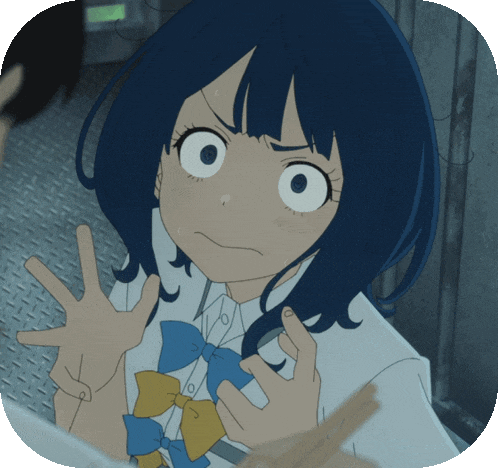
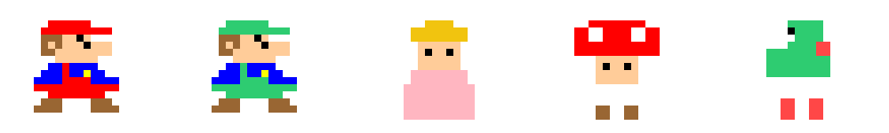
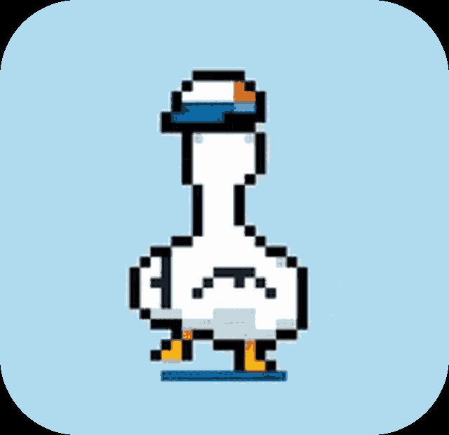

<!-- HEADER RPG DIALOGUE BOX -->

  

<!-- SOCIAL CONNECT -->

  
  
  
  

---

<!-- INTRO -->
###  About Me

IT student passionate about building **Discord Bots**, **Backend** architectures, and **Pixel Art** aesthetics.

* 🚀 **Main Project:** `Anna Bot` (Discord Bot & Web Controller)
* 📘 **Currently Leveling Up:** Node.js, React, Java ecosystem & Event-Driven Architecture
* 🎮 **When AFK:** Exploring **Wuthering Waves**, climbing ranks in **Valorant**, and collecting pixel retro art

---

<!-- FEATURED PROJECT -->
###  Featured Project: Anna Bot

  
  
  
  

> An all-in-one Discord bot paired with a dedicated, real-time Web UI controller.

* 🎧 **24/7 High-Quality Audio:** Smooth streaming from YouTube & Spotify, queue management, smart autoplay, synchronized lyrics, and the cutting-edge **Discord DAVE E2EE** audio protocol.
* 🎛️ **Web Controller:** Modern dashboard built with **React 18 & Tailwind CSS**, allowing seamless music control right from the browser without typing commands.
* 🎮 **Community & Utility:** Wordchain & Wordscramble minigames, automated *Wuthering Waves* giftcode scraper, and proactive auto-moderation.
* 🛠️ **Tech Stack:** `Node.js` • `discord.js v14` • `React 18` • `Express.js` • `MongoDB`

---

<!-- TECH STACK -->
###  Core Tech Stack

  

* **Languages:** JavaScript, Java, SQL
* **Technologies:** Node.js, discord.js v14, React 18, Express REST API, MongoDB, Redis
* **Tools & Environment:** Git, Docker (basics), Postman, VS Code, IntelliJ IDEA

---

<!-- THE PIXEL CORNER -->
###  The Pixel Corner

  

---

<!-- FOOTER -->

  

  <i>"It works on my machine..."</i>

  

